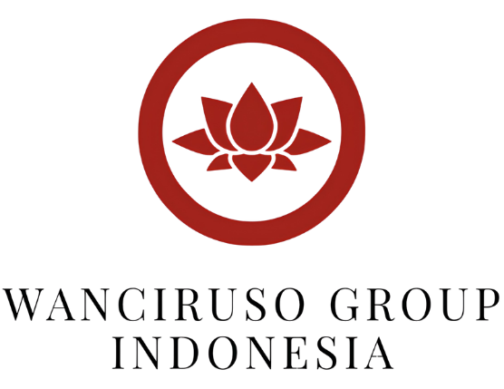

# PT Wanciruso Group Indonesia (WGI) — Corporate Holding Web Portal & Semi-CMS



Portal website resmi semi-CMS untuk **PT Wanciruso Group Indonesia (WGI)**, perusahaan holding nasional yang menaungi 8 unit bisnis lintas sektor (Perdagangan & Ekspor-Impor, Alat Berat, Transportasi, Otomotif, Manufaktur Kemasan Kayu ISPM#15, Konstruksi & Real Estate, Percetakan, dan Agribisnis).

---

## 🛠️ Arsitektur & Technology Stack

Sistem dibangun menggunakan arsitektur **Headless Decoupled**:

1. **Frontend (Public Visitors & SSR SEO)**:
   - **Nuxt 3** (Server-Side Rendering)
   - **Vue 3** & **TypeScript**
   - Design Tokens & Responsive Glassmorphism UI
   - Light & Dark Mode Toggle System

2. **Backend (Admin CMS & REST API)**:
   - **Laravel 11**
   - **FilamentPHP Admin Panel** (`/admin`)
   - **MySQL 8.0** Database
   - RESTful API (`/api/v1/...`)

---

## 🚀 Panduan Setup & Jalankan Lokal

### Prasyarat
- PHP >= 8.2
- Node.js >= 18
- MySQL Server / Laragon

### 1. Backend Setup (`backend/`)
```bash
cd backend
composer install
cp .env.example .env
php artisan key:generate
php artisan migrate --seed
php artisan serve
```
Admin Panel dapat diakses di: `http://localhost:8000/admin`  
Kredensial Default: `admin@wancirusogroup.co.id` / `password123`

### 2. Frontend Setup (`frontend/`)
```bash
cd frontend
npm install
npm run dev
```
Akses publik website di: `http://localhost:3000`

---

## 📄 Lisensi
© 2026 PT Wanciruso Group Indonesia. All Rights Reserved.
